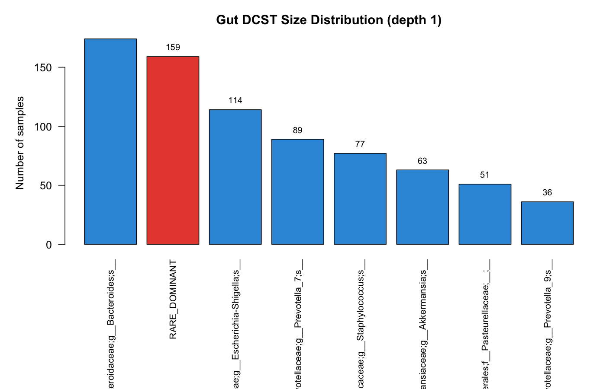

<!-- README.md is generated from README.Rmd. Please edit that file -->

<!-- badges: start -->
[](https://github.com/pgajer/linf/actions/workflows/R-CMD-check.yaml)
[](https://doi.org/10.48550/arXiv.2503.21543)
<!-- badges: end -->

# linf — L∞ Normalization and Dominant Community State Types for Compositional Data

**linf** is a lightweight R package for analysing compositional
data through L-infinity (L∞) normalization and Dominant Community State Types
(dCSTs).

Classical centered log-ratio (CLR) and isometric log-ratio (ILR) coordinates
are defined only for strictly positive compositions. Zero-containing
observations lie on the boundary of the simplex and must first undergo
pseudocount addition or zero replacement, which represents them as interior
compositions. This is questionable when zeros represent true absence,
especially when every sample contains structural zeros, as is common in
microbiome feature tables: replacement then represents every sample as
containing every feature in the analysed feature set. For vaginal 16S rRNA or
metagenomic data, this would imply that every vaginal microbial community
contains every phylotype included in the analysis, a biologically implausible
assumption. L∞ normalization retains zeros: dividing each sample by its maximum
places the observation on the boundary of the unit L∞ ball. The dominant
feature — the one that achieves the maximum — defines a natural, parameter-free
partition of samples into **dominance sample sets**.

dCST construction is rank based. Depth-1 dCSTs partition samples by the rank-1
(most abundant) feature. Deeper dCSTs iteratively refine each retained
dominance-lineage using the next-ranked feature. The support threshold *n*₀
sets the minimum sample count required to retain a dominance sample set.

## Installation

```r
# From GitHub (development version)
# install.packages("devtools")
devtools::install_github("pgajer/linf", build_vignettes = TRUE)
```

or

```r
# From CRAN
install.packages("linf")
```

## Features

- **L∞ normalization** — `normalize.linf()`: row-wise division by maximum,
  mapping each sample to the L∞ unit-ball boundary.
- **Dominant-feature assignment** — `linf.dominant.features()`: rank-1 assignment per
  sample, returning indices, labels, and level sets.
- **Truncated dCSTs** — `linf.csts()`: apply the support threshold *n*₀ and
  either group low-support samples together or absorb them into retained
  states.
- **Iterative refinement** — `refine.linf.csts()`: depth-2+ dCSTs via
  successive rank decomposition, with automatic or explicit lineage selection.
- **Landmark profiles** — `linf.landmarks()`: representative compositional
  profiles (endpoint max/min, mean) for each dCST.
- **ASV filtering** — `filter.asv()`: library-size and prevalence filtering
  for amplicon count matrices.

## Quick Start

```r
library(linf)

set.seed(1)

# toy counts (samples × features)
S.counts <- matrix(rpois(10 * 3, 5), nrow = 10, ncol = 3,
                   dimnames = list(paste0("s", 1:10), c("A", "B", "C")))

# L∞ relatives (nonzero rows have max 1; zeros remain zero)
Z <- normalize.linf(S.counts)
apply(Z, 1, max)
#> returns 1 for nonzero rows, 0 for all-zero rows

# Dominant-feature assignments: indices + labels
dominant.features <- linf.dominant.features(Z)
table(dominant.features$label, useNA = "ifany")

# Absorb-policy dCSTs: reassign low-support samples among retained states
res <- linf.csts(Z, n0 = 4, low.freq.policy = "absorb")
table(res$lineage.label, useNA = "ifany")
```

## Gut Microbiome Demonstration

The figure below illustrates depth-1 dCSTs fitted under the absorb policy to a
bundled set of 766 gut microbiome samples from the American Gut Project (AGP).
After filtering, 763 samples and 307 taxa remain. With *n*₀ = 30, samples from
provisional dominance sample sets below the support threshold are reassigned to
the retained state for which they have the largest normalized abundance; no
composite rare category is shown.

The subset was deliberately stratified to include every sample assigned to four
selected uncommon dCSTs; the remaining slots are a seed-42 simple random sample
from the eligible background. Phenotypes do not influence selection. The
object is suitable for demonstrating the package workflow, but its phenotype
frequencies, effect sizes, and p-values must not be interpreted as population
estimates because inclusion probabilities differ by dCST.

### dCST Size Distribution



The 763 filtered samples are assigned among seven retained dCSTs. The largest
are *Bacteroides* (239 samples), *Escherichia-Shigella* (134), and
*Staphylococcus* (102). In total, 159 samples from low-support provisional
dominance sample sets are absorbed into retained states.

See `vignette("linf-intro")` for the package-safe demonstration. The
[full-analysis source](https://github.com/pgajer/linf/blob/main/vignettes/articles/gut-dcst-disease-analysis.Rmd)
uses an independently selected 5,000-sample analysis cohort and is maintained
as a companion repository article rather than a package vignette.

## Vignettes

The package ships with two vignettes:

- **Dominant Community State Types: From Normalization to a Gut Demonstration** — a
  step-by-step tutorial covering L∞ normalization, dominant-feature assignment,
  truncated dCSTs, and descriptive exploration of the bundled AGP gut data.
- **dCSTs for Vaginal Microbiome Data** — applying the pipeline to the
  Valencia 2k vaginal dataset, demonstrating how dCSTs recover the classical
  community state types (CST I–V) without supervised training.
```r
browseVignettes("linf")
```

## Citation

If you use this package, please cite:

> Gajer, P. & Ravel, J. (2025). A New Approach to Compositional Data Analysis
> using L∞-normalization with Applications to Vaginal Microbiome. *arXiv
> preprint arXiv:2503.21543* [stat.CO].
> doi: [10.48550/arXiv.2503.21543](https://doi.org/10.48550/arXiv.2503.21543)

**BibTeX**
```bibtex
@article{gajer2025linf,
  title   = {A New Approach to Compositional Data Analysis using
             {$L^{\infty}$}-normalization with Applications to
             Vaginal Microbiome},
  author  = {Gajer, Pawel and Ravel, Jacques},
  year    = {2025},
  eprint  = {2503.21543},
  archivePrefix = {arXiv},
  primaryClass  = {stat.CO},
  journal = {arXiv preprint arXiv:2503.21543},
  doi     = {10.48550/arXiv.2503.21543},
  url     = {https://arxiv.org/abs/2503.21543}
}
```

## License

MIT © 2025 Pawel Gajer. See `LICENSE` / `LICENSE.md`.
Bundled-data sources and upstream terms are recorded in
`inst/DATA_PROVENANCE.md`.
