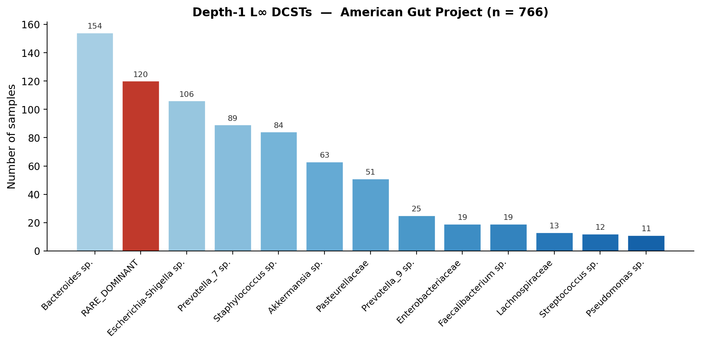
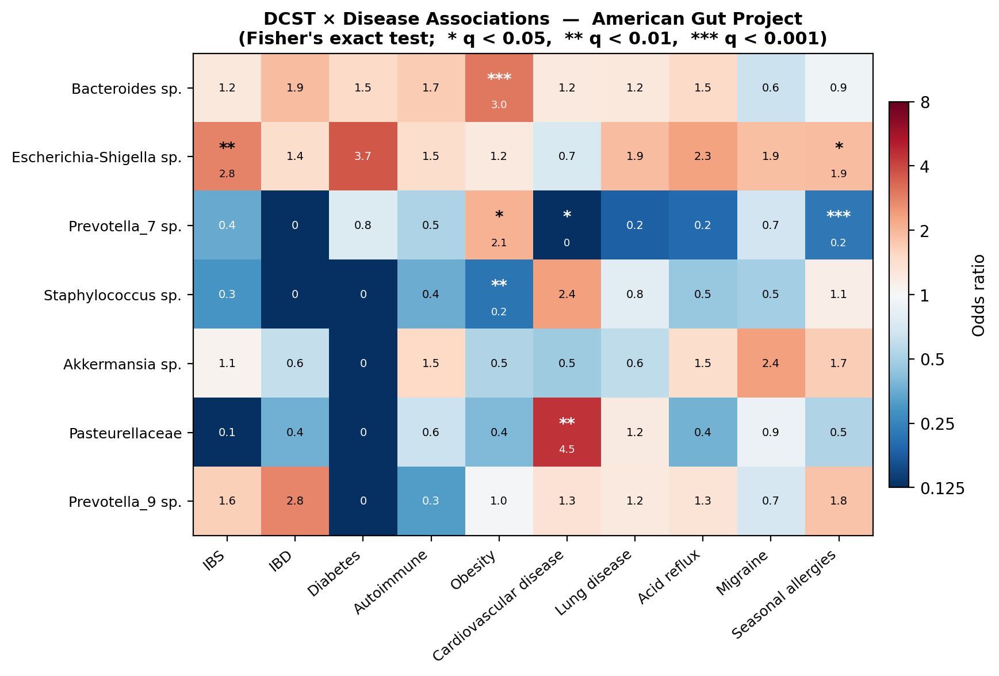

<!-- README.md is generated from README.Rmd. Please edit that file -->

<!-- badges: start -->

[](https://github.com/pgajer/linf/actions/workflows/R-CMD-check.yaml)
[](https://doi.org/10.48550/arXiv.2503.21543)
<!-- badges: end -->

# linf — L∞ Normalization and DCSTs for Compositional Data

**linf** is a minimal, dependency-free R package for analysing compositional
data through L-infinity (L∞) normalization and Dominant Community State
Types (DCSTs).

Standard compositional approaches (CLR, ILR) map data into log-ratio
coordinates, introducing complications with zeros and obscuring the
dominant features that often drive biological variation. L∞ normalization
takes a different path: divide each sample by its maximum, placing every
observation on the boundary of the unit L∞ ball. The dominant feature —
the one that achieves the maximum — defines a natural, parameter-free
partition of samples into **L∞ cells** (DCSTs).

At its core this is a **rank-based analysis**. Depth-1 DCSTs partition
samples by the rank-1 (most abundant) feature. Depth-2 DCSTs refine each
cell using the rank-2 feature, and so on. This perspective connects L∞
DCSTs to one of the oldest branches of statistical methodology — rank
analysis — while the L∞ geometry adds a principled compositional
framework and a single, interpretable size threshold *n*₀.

This package accompanies: Gajer & Ravel (2025), *A New Approach to
Compositional Data Analysis using L∞-normalization with Applications to
Vaginal Microbiome*
([arXiv:2503.21543](https://doi.org/10.48550/arXiv.2503.21543)).

## Installation

``` r
# From GitHub (development version)
# install.packages("devtools")
devtools::install_github("pgajer/linf", build_vignettes = TRUE)
```

or

``` r
# From CRAN
install.packages("linf")
```

## Features

- **L∞ normalization** — `normalize.linf()`: row-wise division by
  maximum, mapping each sample to the L∞ unit-ball boundary.
- **Cell assignment** — `linf.cells()`: dominant-feature (rank-1)
  assignment per sample, returning indices, labels, and level sets.
- **Truncated DCSTs** — `linf.csts()`: keep cells with ≥ *n*₀ samples,
  reassign rare dominants by restricted argmax.
- **Iterative refinement** — `refine.linf.csts()`: depth-2+ DCSTs via
  successive rank decomposition.
- **Landmark profiles** — `linf.landmarks()`: representative
  compositional profiles (endpoint max/min, mean) for each DCST.
- **ASV filtering** — `filter.asv()`: library-size and prevalence
  filtering for amplicon count matrices.
- **Pipeline wrapper** — `asv.to.linf.csts()`: counts → filter →
  normalise → truncated DCSTs in one call.

## Quick Start

``` r
library(linf)

set.seed(1)

# toy counts (samples × features)
S.counts <- matrix(rpois(10 * 3, 5), nrow = 10, ncol = 3,
                   dimnames = list(paste0("s", 1:10), c("A", "B", "C")))

# L∞ relatives (nonzero rows have max 1; zeros remain zero)
Z <- normalize.linf(S.counts)
apply(Z, 1, max)
#> returns 1 for nonzero rows, 0 for all-zero rows

# L∞ cells: indices + labels
cells <- linf.cells(Z)
table(cells$label, useNA = "ifany")

# Truncated DCSTs: keep cells with at least n0 samples
res <- linf.csts(Z, n0 = 4)
table(res$cell.label, useNA = "ifany")
```

## Gut Microbiome: DCST–Disease Associations

The figures below illustrate L∞ DCSTs applied to 766 gut microbiome
samples from the American Gut Project (AGP). Without clustering,
reference databases, or parameter tuning beyond the threshold *n*₀, the
pipeline recovers dominant taxa and reveals clinically meaningful disease
associations via Fisher's exact test with Benjamini–Hochberg correction.

### DCST Size Distribution



The most common depth-1 DCSTs are *Bacteroides* (154 samples),
*Escherichia-Shigella* (106), and *Prevotella_7* (89). The red bar marks
RARE_DOMINANT — samples whose rank-1 taxon does not form a large enough
cell, a signature of unusual or low-abundance dominance.

### DCST × Disease Heatmap



Among the significant associations (q \< 0.05): *Bacteroides* enrichment
in obesity (OR ≈ 3.0), *Escherichia-Shigella* enrichment in IBS
(OR ≈ 2.8), *Pasteurellaceae* enrichment in cardiovascular disease
(OR ≈ 4.5), and *Prevotella_7* depletion in seasonal allergies
(OR ≈ 0.2).

See `vignette("linf-intro")` and the companion article [Gut DCST–Disease
Associations](https://pgajer.github.io/linf/articles/gut-dcst-disease-analysis.html)
for the full analysis.

## Vignettes

The package ships with three vignettes:

- **L-Infinity CSTs: From Normalization to Disease Associations** — a
  step-by-step tutorial covering L∞ normalization, cell assignment,
  truncated DCSTs, and disease-association testing on the bundled AGP gut
  data.
- **DCSTs for Vaginal Microbiome Data** — applying the pipeline to the
  Valencia 2k vaginal dataset, demonstrating how L∞ DCSTs recover the
  classical community state types (CST I–V) without supervised training.
- **Gut DCST–Disease Associations: Full AGP Analysis** — a companion
  article with the full 5,000-sample AGP analysis and landmark profiles.

``` r
browseVignettes("linf")
```

## Notes & Conventions

- Dot-delimited function names (e.g., `filter.asv`, `normalize.linf`).
- `linf.cells()` is invariant to positive row scaling (counts vs
  relatives).
- Ties resolve to the **first** maximum (as in
  `max.col(..., ties.method = "first")`).
- All-zero rows get `NA` for both `index` and `label`.

## Citation

If you use this package, please cite:

> Gajer, P. & Ravel, J. (2025). A New Approach to Compositional Data
> Analysis using L∞-normalization with Applications to Vaginal
> Microbiome. *arXiv preprint arXiv:2503.21543* \[stat.CO\]. doi:
> [10.48550/arXiv.2503.21543](https://doi.org/10.48550/arXiv.2503.21543)

**BibTeX**

``` bibtex
@article{gajer2025linf,
  title   = {A New Approach to Compositional Data Analysis using
             {$L^{\infty}$}-normalization with Applications to
             Vaginal Microbiome},
  author  = {Gajer, Pawel and Ravel, Jacques},
  year    = {2025},
  eprint  = {2503.21543},
  archivePrefix = {arXiv},
  primaryClass  = {stat.CO},
  journal = {arXiv preprint arXiv:2503.21543},
  doi     = {10.48550/arXiv.2503.21543},
  url     = {https://arxiv.org/abs/2503.21543}
}
```

## License

MIT © 2025 Pawel Gajer. See `LICENSE` / `LICENSE.md`.
